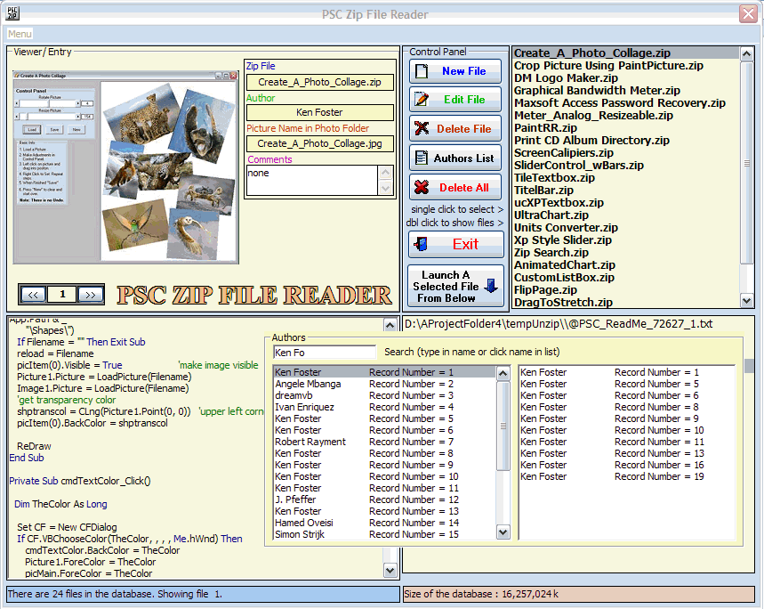

## PSC Zip Store and read

### Description

Total remake of earlier submission. I'm using database to to store author,project picture and comments. The actual zip file is stored in a separate folder for easy excess. Project photos can also be saved to a separate folder if option is selected.
 
### More Info
 

             |
---                |---
**Submitted On**   |2010-01-14 18:15:48
**By**             |[Kenneth Foster](https://github.com/Planet-Source-Code/PSCIndex/blob/master/ByAuthor/kenneth-foster.md)
**Level**          |Intermediate
**User Rating**    |4.8 (29 globes from 6 users)
**Compatibility**  |VB 6\.0
**Category**       |[Databases/ Data Access/ DAO/ ADO](https://github.com/Planet-Source-Code/PSCIndex/blob/master/ByCategory/databases-data-access-dao-ado__1-6.md)
**World**          |[Visual Basic](https://github.com/Planet-Source-Code/PSCIndex/blob/master/ByWorld/visual-basic.md)
**Archive File**   |[PSC\_Zip\_St217419232010\.zip](https://github.com/Planet-Source-Code/kenneth-foster-psc-zip-store-and-read__1-72889/archive/master.zip)

